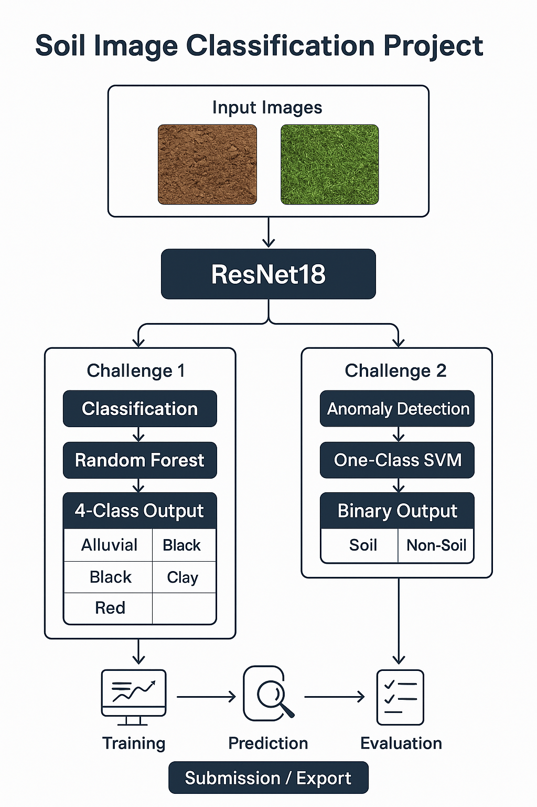

<h1>🏆 Soil Classification Challenge Submission</h1>

<p>This project was developed as part of the Hackathon + Internship opportunity organized by IIT Ropar and Annam.ai. I, Gogul Gupta, participated solo and built ML models for classifying soil types from images. This task aimed to automate soil-type classification to assist in agriculture and sustainability using AI. Special thanks to <strong>Sudarshan Iyengar</strong>, <strong>Madhur Tharuja</strong>, and the entire <strong>Annam AI & IIT Ropar</strong> team for organizing this opportunity!</p>

<p align="center">
  
</p>

<p>Below is the detailed overview of my project, approach, and findings.</p>

---

## 👤 Participant Details

- **Name:** Gogul Gupta  
- **Team Name:** shree yantra dynamics
- **Year:** 3nd Year B.Tech CSE (AI&ML)
- **University:** Dr. A.P.J. Abdul Kalam Technical University 
- **Email:** gogulguptaji@gmail.com  
- **Radhe Radhe! 🙏**  

> **Note:** Initially the entire pipeline was in a single notebook, which has now been refactored into this structured repository.

---

## 📊 Leaderboard Performance

| Task                                         | Score  | Public Rank | Private Rank |
|----------------------------------------------|--------|-------------|--------------|
| Task 1 - Binary Soil Classification          | 1.000  | 56          | 40           |
| Task 2 - Multi-Class Soil Image Classification | 0.8989 | 37          | 48           |

---

## 🗂️ Project Structure

```bash
.
├── challenge-1/             # Binary classification resources
│   ├── notebooks/           # Notebooks & scripts for Task 1
│   └── README.md            # Detailed Challenge 1 instructions
├── challenge2/              # Multi-class classification resources
│   ├── notebooks/           # Notebooks & scripts for Task 2
│   └── README.md            # Detailed Challenge 2 instructions
├── notebooks/               # Legacy notebooks (training & inference)
│   ├── training.ipynb
│   └── inference.ipynb
├── models/                  # Saved model weights
├── data/                    # (Not included) -- download manually
├── requirements.txt         # Python dependencies
├── download.sh              # Dataset download script
├── submission.csv           # Final submission predictions
└── README.md                # This file
Note: Data is excluded due to size; download manually. Large files are ignored via .gitignore.

🧠 Approach Overview
🔹 Task Objective
Classify soil images into one of the four categories:

Alluvial

Black

Clay

Red

🔹 Modeling Pipeline
Model Architecture: Transfer learning using pretrained CNNs like ResNet-18, EfficientNet-B0

Training Strategy:

Image normalization, resizing to 224x224

Stratified train-validation split

Data augmentation (flip, rotate, brightness)

Cross-validation for robustness

Inference:

Ensemble averaging for stability

🛠️ Tools & Technologies
Python 🐍

PyTorch / Torchvision

Scikit-learn

OpenCV

Matplotlib / Seaborn

Jupyter Notebooks


📓 Notebooks Breakdown
training.ipynb
Loads and preprocesses image dataset

Applies augmentations and normalizations

Extracts features using pretrained CNNs (e.g., ResNet18)

Trains classifiers (e.g., fully connected layers or Random Forests)

Plots metrics and saves trained models

inference.ipynb
Loads saved models and test data

Applies augmentations (horizontal/vertical flips, brightness)

Generates predictions

Outputs submission.csv as per competition format

📈 Evaluation Metric
Metric Used: Minimum F1-score across all 4 classes

python
Copy code
from sklearn.metrics import f1_score
score = min([
    f1_score(y_true, y_pred, average=None)[i] for i in range(4)
])
⚙ Setup Instructions
Clone the repository

bash
Copy code
git clone https://github.com/gogulgupta/Soil-classification-project.git
cd Soil-classification-project
Install dependencies

bash
Copy code
pip install -r requirements.txt
Download the dataset

bash
Copy code
bash download.sh
Run notebooks

notebooks/training.ipynb → train models

notebooks/inference.ipynb → generate submission.csv

⚡ Why This Approach Works
✅ Combines deep learning feature extraction with classical ML models
✅ Balanced F1-score strategy ensures no class is ignored
✅ Simple yet effective – reproducible and scalable

💬 Reflections
I participated solo in this challenge and acknowledge that my submission may not compete head-to-head with full teams, but I gave my best and learned a lot! Looking forward to the next rounds if selected. Jai Shree Krishna 🙏

ain

👨‍💻 Author
Gogul Gupta
Email: gogulguptaji@gmail.com
University: Dr. A.P.J. Abdul Kalam Technical University
Connect with me for ML, AI, or vision projects! 🚀

📬 Contact
If any reviewer or peer wants to discuss this submission or connect:

Email: gogulguptaji@gmail.com